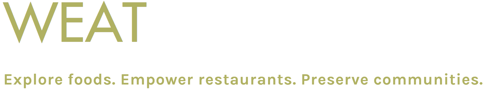

  <a href="https://weatinc.com/">
   
  </a>

-----------------

# weat: a meal delivery app toolkit

## about the project

This project tracks the progress of **weat Inc**'s application. The project is open source, and is meant to make creating a food delivery application easy. Feel free to contribute to this project, and to create any issues that you may find!

## main features
Here are some of the features that we have built and are currently working on:
  - An intuitive **<a href="https://github.com/weatosd/weat/tree/main/backend">database</a>** that mimics Firebase's **<a href="https://firebase.google.com/docs/firestore">Firestore</a>**, build using Python3.
  - An **<a href="https://github.com/weatosd/weat/tree/main/api">api</a>** for interacting and serving data from the database.
  - Coming up: a frontend build from Python that mimics user actions

## User research & closing remarks

One of my goals is to conduct customer research to pinpoint our potential customer's struggles and needs, and what features could benefit them from our app. Like Professor Paine quoted, we need to treat our users as co-developers, and so we will be spending time in the early stages conducting virtual interviews to see what we actually need to build.

We will need to use Git version control, React for the front end, and Python the backend. 

The COVID19 pandemic has brought restaurant businesses in a precarious position, with many facing or already experiencing closure. I truly believe that this application can help remedy the situation and have a positive social impact.

